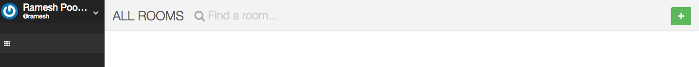
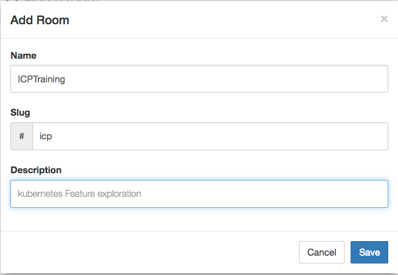

# K8Lab

This lab is to kick start your journey IBM Container Service, You can find instructions to execute and supporting files in this repo

# Setting up environment
Set up IBM Cloud CLI : Command line interface to manage applications, containers, infrastructures, services
https://console.bluemix.net/docs/cli/reference/bluemix_cli/get_started.html#getting-started
verify by using command like bx help

Install IBM cloud CLI(bx) :
```
https://console.bluemix.net/docs/cli/reference/bluemix_cli/get_started.html#getting-started
```

Install container service  Plugins :
```
bx plugin install container-service -r Bluemix
```

Create Cluster on IBM cloud: Login with ibm cloud credentionals and create service Containers in Kubernetes Clusters from service catalog. Please refer below link.
https://console.bluemix.net/docs/containers/container_index.html#container_index

Install Kubernetes Cluster :
```
https://console.bluemix.net/containers-kubernetes/catalog/cluster/create
```

Install and Set Up kubectl: kubectl, a Kubernetes command-line tool, to deploy and manage applications on Kubernetes.
There are multiple to option to install kubectl.

Install Kubernetes CLI:
```
https://kubernetes.io/docs/tasks/tools/install-kubectl/
```

Install Helm:
```
https://github.com/kubernetes/helm/blob/master/docs/install.md
```


# letschat App - Group Activity

Lets explore the kubernetes highavailability feature by bringing down pods. lets participants signup to the letschat application and start chatting between them, while they are chatting, we will kill the letschat pods and show the impact and how fast new pod is deployed and available for user to access.

Before starting this activity, make sure that previous application deployment is complete and letschat application is up and running.

1. Signup to the LetsChat App.
    - Access the application using url " http://<your_cluster_ip>:30080".
    - Click on "I need account" link.
    > 
    - Fill the required details like User name and password then click Register button.
    > 

2. Login using the  credentials created in step.


3. After successful login, Click on "+" button on top right corner of the page to create the Chat Room.


4. Enter chat room details, Click on save.


5. Request the Participants to follow the steps 1 & 2 and join the chat room.


6. Request participants to keep chatting and we will kill the pods in server.

7. execute following commands to kill  pods.
```
kubectl get pods -l "app=letschat"
kubectl delete pod <pod name>
```
8. check the pods status now, you will get response with pods, one is in deleting state and one is Running state.

```
kubectl get pods -l "app=letschat"
```
