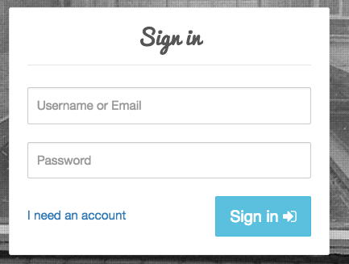
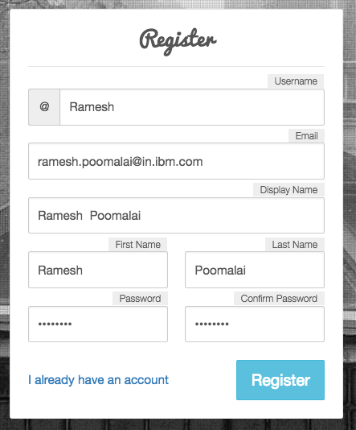

# K8Lab

This lab is to kick start your journey IBM Container Service, You can find instructions to execute and supporting files in this repo

# Setting up environment
Set up IBM Cloud CLI : Command line interface to manage applications, containers, infrastructures, services
https://console.bluemix.net/docs/cli/reference/bluemix_cli/get_started.html#getting-started
verify by using command like bx help

Install IBM cloud CLI(bx) :
```
https://console.bluemix.net/docs/cli/reference/bluemix_cli/get_started.html#getting-started
```

Install container service  Plugins :
```
bx plugin install container-service -r Bluemix
```

Create Cluster on IBM cloud: Login with ibm cloud credentionals and create service Containers in Kubernetes Clusters from service catalog. Please refer below link.
https://console.bluemix.net/docs/containers/container_index.html#container_index

Install Kubernetes Cluster :
```
https://console.bluemix.net/containers-kubernetes/catalog/cluster/create
```

Install and Set Up kubectl: kubectl, a Kubernetes command-line tool, to deploy and manage applications on Kubernetes.
There are multiple to option to install kubectl.

Install Kubernetes CLI:
```
https://kubernetes.io/docs/tasks/tools/install-kubectl/
```

Install Helm:
```
https://github.com/kubernetes/helm/blob/master/docs/install.md
```


# Steps-Helm-Deploy letschat App :

1. Install Helm Client
        https://docs.helm.sh/using_helm/#installing-helm
        From Homebrew (macOS)
        Members of the Kubernetes community have contributed a Helm formula build to Homebrew. This formula is generally up to date.
      ```
        brew install kubernetes-helm
      ```


2. Login to IBM cloud, Execute ``` bx login ``` on your local system terminal window to login.
 
3. After successful login to IBM cloud, Initialize the Container plugin by executing the below command.
Execute  ``` bx cs init ```
 
4. Make sure kubectl is installed properly and it can communicate to the cluster.

   ``` kubectl version  ```  
   the output of this command should return both server and client version, you can see the client and server version in the below sample output.
   Example output:
```
   Client Version: version.Info{Major:"1", Minor:"7", GitVersion:"v1.7.3",    GitCommit:"2c2fe6e8278a5db2d15a013987b53968c743f2a1", GitTreeState:"clean", BuildDate:"2017-08-03T07:00:21Z", GoVersion:"go1.8.3", Compiler:"gc", Platform:"darwin/amd64"}
   Server Version: version.Info{Major:"1", Minor:"8+", GitVersion:"v1.8.8-2+9d6e0610086578", GitCommit:"9d6e06100865789613cbac936edce948f0710a2f", GitTreeState:"clean", BuildDate:"2018-02-23T08:20:09Z", GoVersion:"go1.8.3", Compiler:"gc", Platform:"linux/amd64"}
```
   Steps 5,6 is required if server version is not printed in step 4

5. Execute ```bx cs cluster``` to get the list of clusters available in your account. If there is no cluster reported then create one by login to Bluemix console.
 
6. Execute ```bx cs cluster-config <cluster name>```,

   Replace <cluster name >  with your cluster name, received from step 4.1, Output of this command return the cluster name and environment setting need to be execute.

   Execute the export command in the output of cluster-config command.
   Example: ``` export KUBECONFIG=/Users/rameshpoomalai/.bluemix/plugins/container-service/clusters/mycluster/kube-config-hou02-mycluster.yml ```

7. Execute the following command to initialize the helm service.
```helm init```


8. Execute the following command to package your charts.
```helm package letschat```
   This will package your charts and that be released to release to your repos.
 
9. Execute ```helm install --debug --dry-run letschat --name frontend``` to to test your charts
 
10. Execute ```helm install letschat --name frontend``` to install your package on your cluster.

11. Execute the following command to package your charts.
   ```helm package mongo```
   This will package your charts and that be released to release to your repos.
 
12. Execute ```helm install --debug --dry-run mongo --name bankend``` to to test your charts
 
13. Execute ```helm install mongo --name bankend``` to install your package on your cluster.


14. Execute the following command to get the public IP address.
```
   bx cs workers <your_cluster_name_created_under_ibm_cloud>
   The output will be similar to as below. The ip marked i bold is cluster IP in my case.
   ID                                                 Public IP      Private IP
   kube-mel01-paedbc7786e21c450e813eadc69ebaf43b-w1   168.1.149.16   10.118.243.226
```
15. Execute  “kubectl get svc” to get Ports exposed by service
```
   $ kubectl get svc
   NAME             CLUSTER-IP      EXTERNAL-IP         PORT(S)                AGE
   letschat         172.21.108.9    <nodes>             8080:30080/TCP         2h
   mongo            172.21.43.81    <none>              27017/TCP              2h
```

16. You can access letschat application by below url.
```
   http://<your_cluster_ip>:30080
```

# letschat App - Group Activity

Lets explore the kubernetes highavailability feature by bringing down pods. lets participants signup to the letschat application and start chatting between them, while they are chatting, we will kill the letschat pods and show the impact and how fast new pod is deployed and available for user to access.

Before starting this activity, make sure that previous application deployment is complete and letschat application is up and running.

1. Signup to the LetsChat App.
    - Access the application using url " http://<your_cluster_ip>:30080".
    - Click on "I need account" link.
    > 
    - Fill the required details, User name and password the click Register button.
    > 

2. Login using the credentionals created in step.


3. After successful login, Click on "+" button on top right corner of the page and create Chat Room.


4. Enter chat room details, Click on save.


5. Request the Participants to follow the steps 1 & 2 and join the chat room.


6. Request participants to keep chatting and we will kill the pods in server.

7. execute following commands to kill  pods.
```
kubectl get pods -l "app=letschat"
kubectl delete pod <pod name>
```
8. check the pods status now, you will get response with pods, one is in deleting state and one is Running state.

```
kubectl get pods -l "app=letschat"
```
